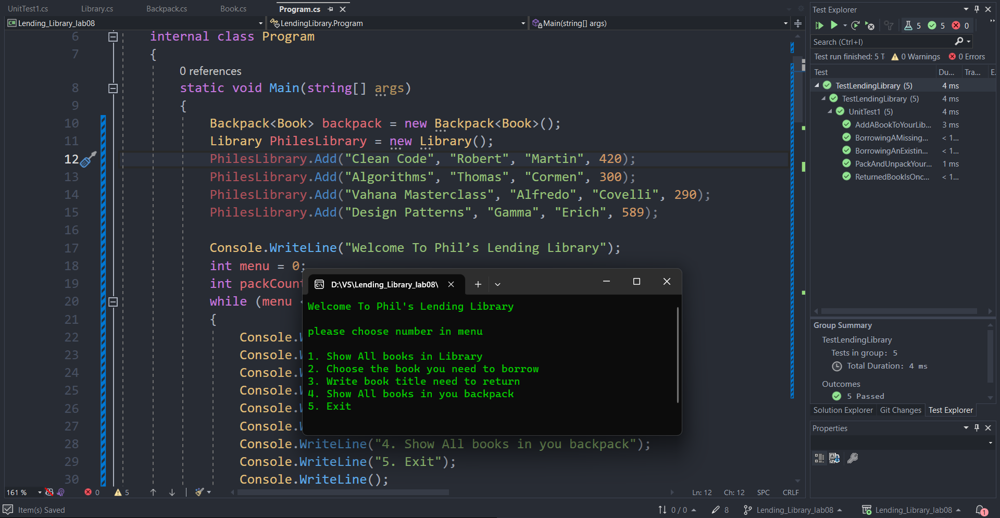
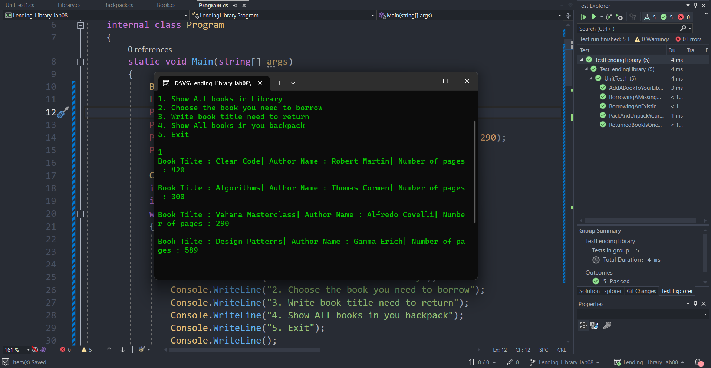

# Lending_Library 🏫

- This is a library console application. The user can show all books in the library and choose the book he needs to borrow. And he can see all books in his backpack.
- The first thing the user we'll see is the user interface and he has five options to choose from. He can choose a number for the process he wants to do.

- This application passed all tests as you can see.✅

